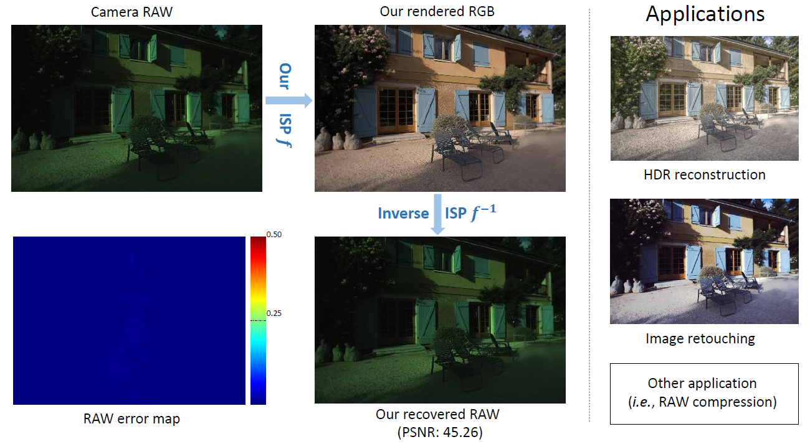
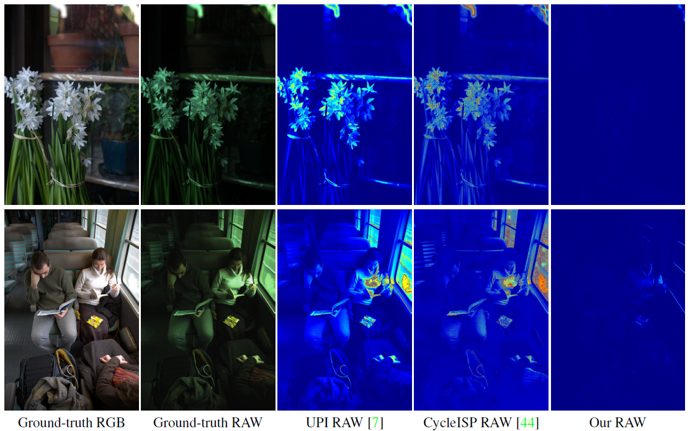

# Invertible Image Signal Processing


**This repository includes official codes for "[Invertible Image Signal Processing (CVPR2021)](https://arxiv.org/abs/2103.15061)".** 


**Figure:** *Our framework*

Unprocessed RAW data is a highly valuable image format for image editing and computer vision. However, since the file size of RAW data is huge, most users can only get access to processed and compressed sRGB images. To bridge this gap, we design an Invertible Image Signal Processing (InvISP) pipeline, which not only enables rendering visually appealing sRGB images but also allows recovering nearly perfect RAW data. Due to our framework's inherent reversibility, we can reconstruct realistic RAW data instead of synthesizing RAW data from sRGB images, without any memory overhead. We also integrate a differentiable JPEG compression simulator that empowers our framework to reconstruct RAW data from JPEG images. Extensive quantitative and qualitative experiments on two DSLR demonstrate that our method obtains much higher quality in both rendered sRGB images and reconstructed RAW data than alternative methods. 

> **Invertible Image Signal Processing** <br>
>  Yazhou Xing*, Zian Qian*, Qifeng Chen (* indicates joint first authors)<br>
>  HKUST <br>

[[Paper](https://arxiv.org/abs/2103.15061)] 
[[Project Page](https://yzxing87.github.io/InvISP/index.html)]
[[Technical Video (Coming soon)](https://yzxing87.github.io/TBA)]


**Figure:** *Our results*


## Known issue (10/2021)
There exists some errors in the bilinear demosaicing implementation of the python library ``colour_demosaicing``. You can fix it through add the 'constant' parameter in convolve method in [this file](https://colour-demosaicing.readthedocs.io/en/latest/_modules/colour_demosaicing/bayer/demosaicing/bilinear.html#demosaicing_CFA_Bayer_bilinear) of your package. Otherwise the demosaicing results will be out of its original range and the trained results will face some incorrect color issues. 

## Installation
Clone this repo.
```bash
git clone https://github.com/yzxing87/Invertible-ISP.git 
cd Invertible-ISP/
```

We have tested our code on Ubuntu 18.04 LTS with PyTorch 1.4.0, CUDA 10.1 and cudnn7.6.5. Please install dependencies by
```bash
conda env create -f environment.yml
```

## Preparing datasets
We use [MIT-Adobe FiveK Dataset](https://data.csail.mit.edu/graphics/fivek/) for training and evaluation. To reproduce our results, you need to first download the NIKON D700 and Canon EOS 5D subsets from their website. The images (DNG) can be downloaded by 
```bash
cd data/
bash data_preprocess.sh
```
The downloading may take a while. After downloading, we need to prepare the bilinearly demosaiced RAW and white balance parameters as network input, and ground truth sRGB (in JPEG format) as supervision. 
```bash
python data_preprocess.py --camera="NIKON_D700"
python data_preprocess.py --camera="Canon_EOS_5D"
```
The dataset will be organized into 
| Path | Size | Files | Format | Description
| :--- | :--: | ----: | :----: | :----------
| data | 585 GB | 1 | | Main folder
| &boxvr;&nbsp; Canon_EOS_5D | 448 GB | 1  | | Canon sub-folder
| &boxvr;&nbsp; NIKON_D700 | 137 GB | 1  | | NIKON sub-folder
| &ensp;&ensp;&ensp;&ensp;&boxvr;&nbsp; DNG | 2.9 GB | 487 | DNG | In-the-wild RAW. 
| &ensp;&ensp;&ensp;&ensp;&boxvr;&nbsp; RAW | 133 GB | 487 | NPZ | Preprocessed RAW. 
| &ensp;&ensp;&ensp;&ensp;&boxvr;&nbsp; RGB | 752 MB | 487 | JPG | Ground-truth RGB. 
| &boxvr;&nbsp; NIKON_D700_train.txt | 1 KB | 1 |  TXT | Training data split. 
| &boxvr;&nbsp; NIKON_D700_test.txt | 5 KB | 1 | TXT  | Test data split. 

## Training networks
We specify the training arguments into `train.sh`. Simply run 
```bash
cd ../
bash train.sh
```
The checkpoints will be saved into `./exps/{exp_name}/checkpoint/`. 

## Test and evaluation 
### Use your trained model 
To reconstruct the RAW from JPEG RGB, we need to first save the rendered RGB into disk then do test to recover RAW. 
Original RAW images are too huge to be directly tested on one 2080 Ti GPU. We provide two ways to test the model. 

1. Subsampling the RAW for visualization purpose: 
  ```bash
  python test_rgb.py --task=EXPERIMENT_NAME \
                  --data_path="./data/" \
                  --gamma \
                  --camera=CAMERA_NAME \
                  --out_path=OUTPUT_PATH \
                  --ckpt=CKPT_PATH
  ```
  After finish, run 
  ```bash
  python test_raw.py --task=EXPERIMENT_NAME \
                  --data_path="./data/" \
                  --gamma \
                  --camera=CAMERA_NAME \
                  --out_path=OUTPUT_PATH \
                  --ckpt=CKPT_PATH
  ```
2. Spliting the RAW data into patches, for quantitatively evaluation purpose. Turn on the `--split_to_patch` argument. See `test.sh.` The PSNR and SSIM metrics can be obtained by 
  ```bash
  python cal_metrics.py --path=PATH_TO_SAVED_PATCHES
  ```
### Use our pretrained weights
We also provide our trained model for a reference. The checkpoints are placed in `pretrained/` folder. Specify the correct PATH in `test.sh`, then you can get similar results as our paper. Please note that in the context of ISP, one trained model can only be applied for a specific camera. This is due to the camera-dependent proprietary raw color space and photo-finishing steps. 


## Citation

```
@inproceedings{xing21invertible,
  title     = {Invertible Image Signal Processing},
  author    = {Xing, Yazhou and Qian, Zian and Chen, Qifeng},
  booktitle = {CVPR},
  year      = {2021}
}
```
## Acknowledgement
Part of the codes benefit from [DiffJPEG](https://github.com/mlomnitz/DiffJPEG) and [Invertible-Image-Rescaling](https://github.com/pkuxmq/Invertible-Image-Rescaling). 

## Contact
Feel free to contact me if there is any question. (Yazhou Xing, yzxing87@gmail.com)
